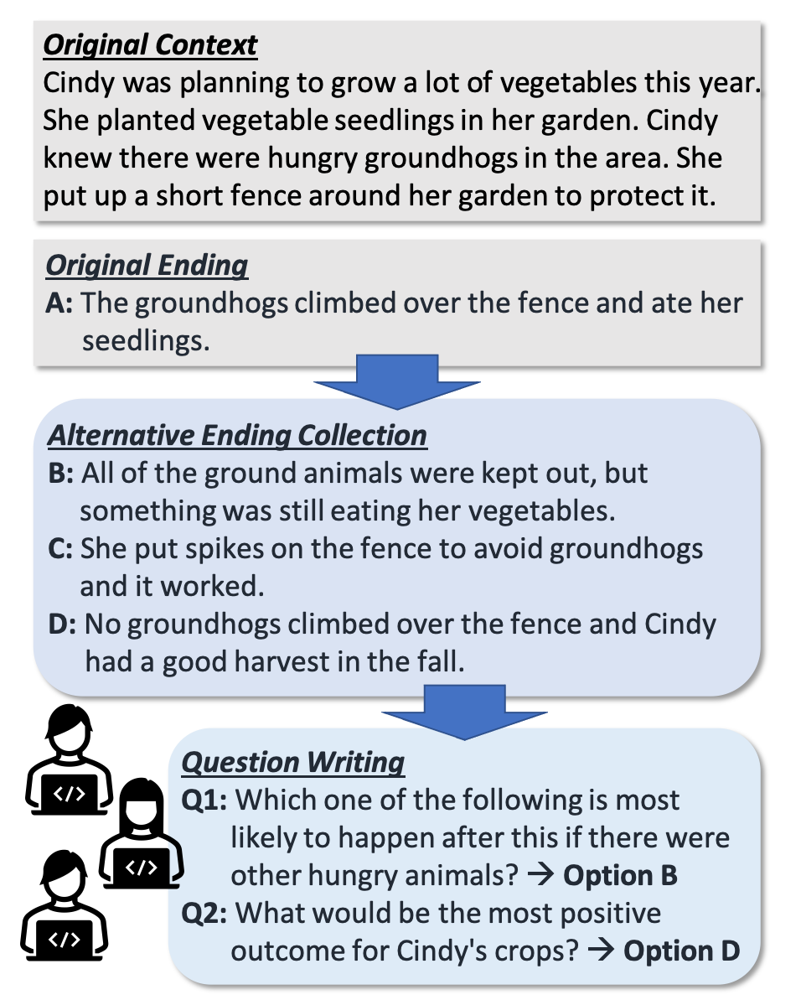

# Possible Stories Dataset

This repository provides the dataset and the crowdsourcing instructions used for our data collection in [Possible Stories: Evaluating Situated Commonsense Reasoning under Multiple Possible Scenarios (Ashida and Sugawara, COLING 2022)](https://aclanthology.org/2022.coling-1.319/).

<p align="center"></p>


## Data

- `datasets` (jsonl format)
  + train, dev, and test split of the Possible Stories dataset.
  + A total of 9K ending sentences written for 1,350 stories in the [ROCStories](https://cs.rochester.edu/nlp/rocstories/) dataset.
- `instructions` (html format for [our crowdsourcing tool](https://github.com/nyu-mll/crowdsourcing-protocol-comparison))
  + ending writing task
  + question writing task
  + validation (question answering) task


## Statistics

| Split | #Question | #Passage | #Q/P |
| ----- | --------- | -------- | ---- |
| Train | 3,404 | 984 | 3.46 |
| Dev | 458 | 133 | 3.44 |
| Test | 671 | 196 | 3.42 |
| Total | 4,533 | 1,313 | 3.45 |

You can find further details in the paper.


## Run Models

To finetune BERT-base and see the result, the command is:
```
$ python run.py --model_name bert-base --train
```
The models available in this script are: `{bert,roberta,deberta}-{base,large}` and `roberta-large-race`.
To edit hyperparameters, you can find their definitions in the script.

We ran the script on python==3.8.5 and transformers==4.25.0.

## Model and Human Performance

Let us know if you achieve higher or comparable performance with your models. We will add them to the tables below for reference.

### Unsupervised Setting (test only)

All RoBERTa/DeBERTa models are fine-tuned on the [RACE dataset](https://aclanthology.org/D17-1082/) to process multiple choice QA.

| Model | Accuracy (%) | Consistency (%) |
| ----- | -------- | ----------- |
| DeBERTa-large | 60.2 | 19.9 |
| RoBERTa-large | 50.5 | 13.8 |
| DeBERTa-base | 45.3 | 8.2 |
| [Flan-T5 XXL](https://huggingface.co/google/flan-t5-xxl) (11B; zero shot)| 80.8 | 51.0 |
| Human | 92.5 | 76.5 |

### Supervised Setting (train and test on our dataset)

| Model | Accuracy (%) | Consistency (%) |
| ----- | -------- | ----------- |
| DeBERTa-large(*) | 92.1 | 74.7 |
| RoBERTa-large(*) | 83.5 | 55.6 |
| DeBERTa-large | 88.5 | 67.3 |
| RoBERTa-large | 81.7 | 49.5 |
| DeBERTa-base | 81.5 | 51.5 |
| BERT-large | 62.6 | 20.4 |
| Human | 92.5 | 76.5 |

(*): Fine-tuned on RACE beforehand.


## License

The collected story endings, questions and options (excluding passages) are released under [Creative Commons Attribution 4.0 International License](https://creativecommons.org/licenses/by/4.0).


## Reference

```
@inproceedings{ashida-sugawara-2022-possible,
    title = "Possible Stories: Evaluating Situated Commonsense Reasoning under Multiple Possible Scenarios",
    author = "Ashida, Mana and Sugawara, Saku",
    booktitle = "Proceedings of the 29th International Conference on Computational Linguistics",
    month = oct,
    year = "2022",
    address = "Gyeongju, Republic of Korea",
    publisher = "International Committee on Computational Linguistics",
    url = "https://aclanthology.org/2022.coling-1.319",
    pages = "3606--3630",
}
```
